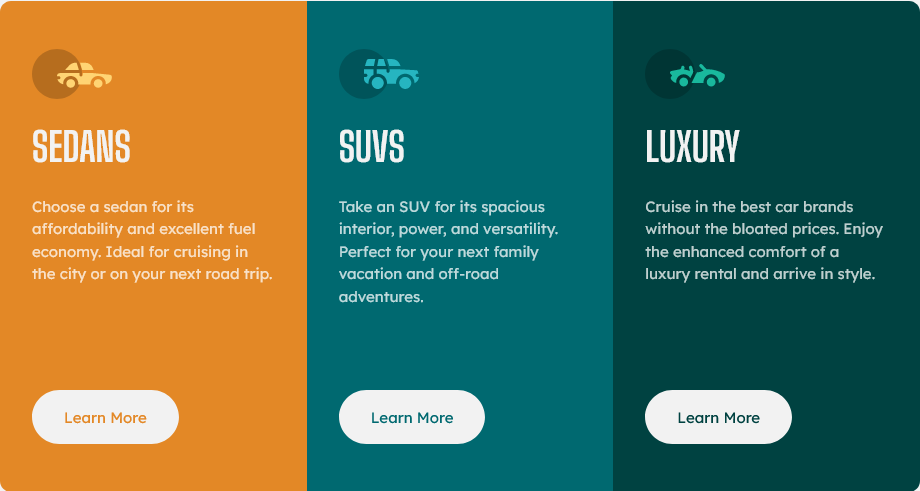

# Frontend Mentor - 3-column preview card component solution

This is a solution to the [3-column preview card component challenge on Frontend Mentor](https://www.frontendmentor.io/challenges/3column-preview-card-component-pH92eAR2-). Frontend Mentor challenges help you improve your coding skills by building realistic projects. 

## Table of contents

- [Overview](#overview)
  - [The challenge](#the-challenge)
  - [Screenshot](#screenshot)
  - [Links](#links)
- [My process](#my-process)
  - [Built with](#built-with)
  - [What I learned](#what-i-learned)
  - [Continued development](#continued-development)
  - [Useful resources](#useful-resources)
- [Author](#author)
- [Acknowledgments](#acknowledgments)

## Overview

One card component.

Used Sass for styling.

Mobile-first styling.

Used BEM for class names and thought a good HTML structure first before styling it.

Flexbox / Grid

### The challenge

Users should be able to:

- View the optimal layout depending on their device's screen size
- See hover and focus states for interactive elements

### Screenshot

### Links

- Solution URL: [https://www.frontendmentor.io/solutions/3-column-preview-card-component-sSanuazkBQ](https://www.frontendmentor.io/solutions/3-column-preview-card-component-sSanuazkBQ)
- Live Site URL: [https://3-column-preview-card-component-sung.netlify.app/](https://3-column-preview-card-component-sung.netlify.app/)

## My process

### Built with

- Semantic HTML5 markup
- CSS custom properties
- CSS Grid and Flexbox
- [CSS reset](https://github.com/mayank99/reset.css) - To baseline cross-browser styles

### What I learned

- To use flexbox inside of a card. Elements by default such as image and buttons were stretched, had to use align-items: start.
- To never use height on any element, except for icons.
- To use height/width on icons.
- To avoid using :link and :visited if I want them to have the same styling.
- To use a button modifier class using BEM: product-card__cta

### Continued development

My main focus is still to create a well-structured HTML first. Also to keep implementing what I've learned for this project. Next step, to use class modifiers following BEM and not general CSS nomenclature.

### Useful resources

- [BEM](https://getbem.com/introduction/)
- [Tweaking Text Level Styles](https://adrianroselli.com/2017/12/tweaking-text-level-styles.html) - For accesibility: "s, del, mark, ins" elements.

## Author

- Frontend Mentor - [@sung92](https://www.frontendmentor.io/profile/sung92)

## Acknowledgments

- I want to thank Grace Snow who helped me on this project and HTML+CSS in general 🙌